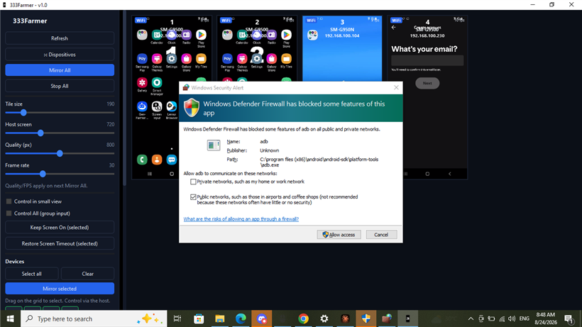

# Performance baseline (unmodified `main` @ c1808c2)

Measured before any optimisation so the final numbers in
[`PERFORMANCE_FINAL.md`](PERFORMANCE_FINAL.md) can be compared like-for-like.

## Test machine

| | |
| --- | --- |
| CPU | Intel Core i5-3230M @ 2.60 GHz (2 cores / 4 threads, Ivy Bridge, 2012) |
| RAM | 16 GB |
| GPU | Intel HD Graphics 4000 (driver 10.18.10.4358), desktop OpenGL |
| OS | Windows 10 Pro 10.0.19045 |
| Network | Wi-Fi, 192.168.100.180/24 |
| Devices | Samsung Galaxy S8 (SM-G9500 / SM-G950N), Android 9 (SDK 28), ADB over TCP :5555 |
| Build | `scripts\build.bat` → MSVC 14.51 (VS 18), Qt 6.11.1, RelWithDebInfo |

The farm LAN had **78 hosts answering on 5555/tcp** at the time of measurement
(probed with a 64-way parallel TCP connect, 3.2 s for the whole /24).

## Method

`scripts\measure-perf.ps1 -Devices N -Load -Warmup (20+2N) -Seconds 30`

1. `adb disconnect`, then `adb connect` the first N addresses found by the probe.
2. Start a reproducible screen load on every device: open *Settings* and swipe
   up/down continuously (`input swipe`) so the encoder keeps producing frames — an
   idle home screen sends almost nothing and would make CPU numbers meaningless.
3. Launch `QtScrcpy.exe --farm` (auto "Mirror All"), wait for warm-up, then sample
   `TotalProcessorTime`, working set, private bytes, threads and handles every 2 s
   for 30 s. CPU is normalised to all 4 logical cores (100 % = whole machine).

Raw samples: [`perf/baseline.jsonl`](perf/baseline.jsonl).

## Results

| Devices | Load | CPU avg | CPU max | Working set | Private | Threads | Handles | adb.exe procs |
| ---: | --- | ---: | ---: | ---: | ---: | ---: | ---: | ---: |
| 4 | idle | 0.8 % | 1.5 % | 130.5 MB | 120.7 MB | 19 | 825 | 5 |
| 1 | motion | 3.7 % | 4.9 % | 89.0 MB | 82.1 MB | 16 | 724 | 3 |
| 5 | motion | 8.6 % | 10.9 % | 126.1 MB | 129.1 MB | 20 | 854 | 11 |
| 10 | motion | 14.1 % | 17.1 % | 161.1 MB | 174.5 MB | 23 | 981 | 19 |
| 20 | motion | 9.8 % | 12.4 % | 135.5 MB | 141.8 MB | 19 | 884 | 14 |

Settings used by the unmodified farm: maxSize 800, bitrate 4 Mbps, maxFps 30,
tile width 190 px, 4 simultaneous connection setups.

### Observations

* **The 20-device run did not actually mirror 20 devices.** Thread and handle counts
  are *lower* than the 10-device run (19 vs 23 threads) and only 14 `adb.exe`
  helper processes were alive: a large part of the fleet never reached the
  mirroring state within the 60 s warm-up. The unmodified code hands out reverse
  ports as `27183 + (seq % 900)` and random `scid`s, resolves `wm size` on every
  connect through a blocking-per-slot `QProcess`, and has no connect timeout or
  retry — so a slow/hung device stalls a connect slot and the rest of the queue.
  **Baseline capacity is therefore "≈10 reliable mirrors on this machine", not 20.**
* CPU cost is ≈1.3–1.5 % (of the whole 4-thread machine) per actively changing
  device stream at 800 px / 30 fps, i.e. ≈5–6 % of one core per device: decode
  (FFmpeg software H.264) + three `makeCurrent/glTexSubImage2D/doneCurrent`
  round-trips per frame per tile.
* Memory: ≈7–8 MB per mirrored device on top of an ≈80 MB base.
* All decoded frames are uploaded to the GPU whether or not the tile is visible in
  the scroll viewport; there is no off-screen throttling.
* Discovery: none at startup beyond `adb devices`; the operator must type IP
  ranges manually. A range sweep spawns up to 16 `adb connect` processes.
* One external `adb.exe` is spawned per operation (screen-timeout, helper-APK
  check, wallpaper push, reboot polling) with no shared timeout/cancellation.

### Not measured in the baseline (no instrumentation exists yet)

Decoded/rendered/dropped FPS, decode→render latency, ADB round-trip latency,
connect latency, reconnect counts and discovery duration are **NOT MEASURED** for
the baseline; the final build adds a Performance page that reports them, and the
final document states clearly which comparisons are before/after and which are
after-only.

